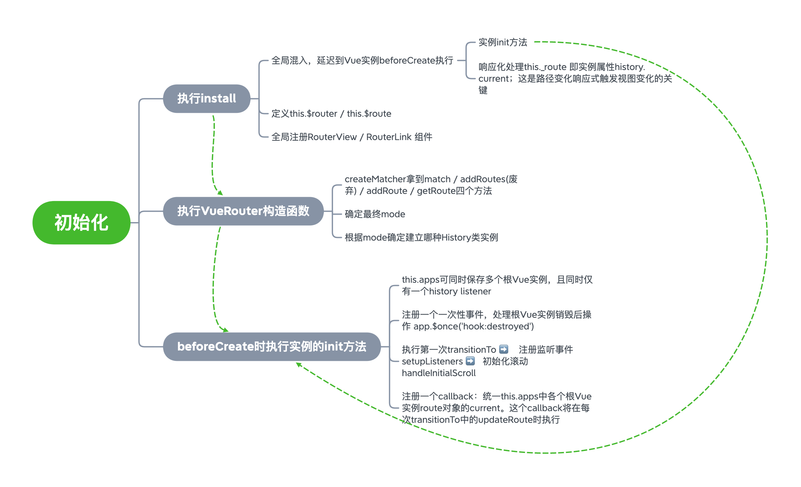
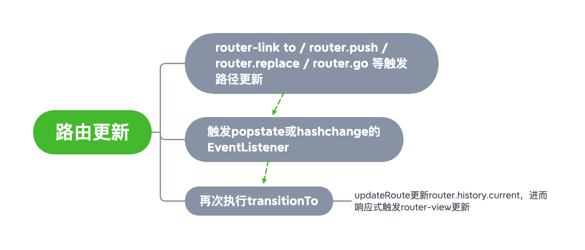

# Learn Vue Router

源码级别学习`Vue Router`，删除一些与学习源码无关的文件夹和文件。

基于[v3.5.1 release](https://github.com/vuejs/vue-router/tree/v3.5.1)

执行`yarn run dev:dist`后即可构建出带sourcemap的代码，可以使用[demo/index.html](./demo/index.html)进行断点调试。

安装了`babel-node`以便在[test/index.js](./test/index.js)中使用`yarn run test`测试你想测试的代码。不过要注意将测试代码和依赖代码中的flow类型注释删除掉。

## 认识几个比较主要的类型定义

1. `RouteConfig` 路由配置对象

   ```typescript
   interface _RouteConfigBase {
     path: string
     name?: string
     children?: RouteConfig[]
     redirect?: RedirectOption
     alias?: string | string[]
     meta?: any
     beforeEnter?: NavigationGuard
     caseSensitive?: boolean
     pathToRegexpOptions?: PathToRegexpOptions
   }
   
   interface RouteConfigSingleView extends _RouteConfigBase {
     component?: Component
     props?: boolean | Object | RoutePropsFunction
   }
   
   interface RouteConfigMultipleViews extends _RouteConfigBase {
     components?: Dictionary<Component>
     props?: Dictionary<boolean | Object | RoutePropsFunction>
   }
   
   export type RouteConfig = RouteConfigSingleView | RouteConfigMultipleViews
   ```

   

2. `RouteRecord` 路由记录对象

   ```typescript
   export interface RouteRecord {
     path: string
     regex: RegExp
     components: Dictionary<Component>
     instances: Dictionary<Vue>
     name?: string
     parent?: RouteRecord
     redirect?: RedirectOption
     matchAs?: string
     meta: any
     beforeEnter?: (
       route: Route,
       redirect: (location: RawLocation) => void,
       next: () => void
     ) => any
     props:
       | boolean
       | Object
       | RoutePropsFunction
       | Dictionary<boolean | Object | RoutePropsFunction>
   }
   ```

   

3. `Route`  路由对象

   ```typescript
   export interface Route {
     path: string
     name?: string | null
     hash: string
     query: Dictionary<string | (string | null)[]>
     params: Dictionary<string>
     fullPath: string
     matched: RouteRecord[]
     redirectedFrom?: string
     meta?: any
   }
   ```

   

4. `Location` 地址对象

   ```typescript
   export interface Location {
     name?: string
     path?: string
     hash?: string
     query?: Dictionary<string | (string | null)[] | null | undefined>
     params?: Dictionary<string>
     append?: boolean
     replace?: boolean
   }
     
   export type RawLocation = string | Location
   ```

## 思维导图





## 解析核心流程和特性

### 1. 路由初始化

待补充

### 2. 路由跳转

待补充

### 3. 嵌套的路由/视图表；模块化的、基于组件的路由配置

1. 路由配置表转换成路由记录映射的过程[create-route-map](./src/create-route-map.js)

### 4. 路由参数、查询、通配符

1. 地址对象转换成路由对象的过程[createRoute](./src/util/route.js)

2. `this.$route`怎么变成当前路由对象的？

   ```javascript
   // install.js -- line 42~44
   // this.$route => this._routerRoot._route
   Object.defineProperty(Vue.prototype, '$route', {
     get () { return this._routerRoot._route }
   })
   ```
   
   ```javascript
   // this => this._routerRoot
   // this._route => this._routerRouter._route => 响应化的this._router.history.current
   this._routerRoot = this // install.js -- line 24
   Vue.util.defineReactive(this, '_route', this._router.history.current) // install.js -- line 27
   ```

### 5. 基于 Vue.js 过渡系统的视图过渡效果

路由切换本质上就是组件动态切换渲染，所以 Vue.js 应用在组件上的过渡系统在VueRouter上仍然适用。VueRouter本身未进行特殊的处理。

### 6. 细粒度的导航控制

此处我理解指的是导航守卫的执行

待补充

### 7. 带有自动激活的 CSS class 的链接

[router-link](./src/components/link.js)组件实现

### 8. HTML5 历史模式或 hash 模式，在 IE9 中自动降级

```javascript
// index.js -- line 52~63
// 根据配置的fallback值、是否支持pushState API、运行环境来进行mode的选择
let mode = options.mode || 'hash'
// 当浏览器不支持pushState时是否回退到hash模式
this.fallback =
  mode === 'history' && !supportsPushState && options.fallback !== false
if (this.fallback) {
  mode = 'hash'
}
if (!inBrowser) {
  mode = 'abstract'
}
// 拿到最终mode
this.mode = mode
```

### 9. 自定义的滚动条行为

[scroll](./src/util/scroll.js)